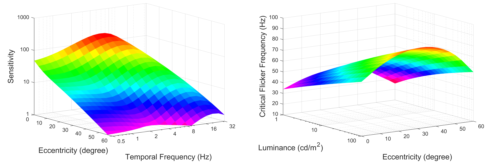
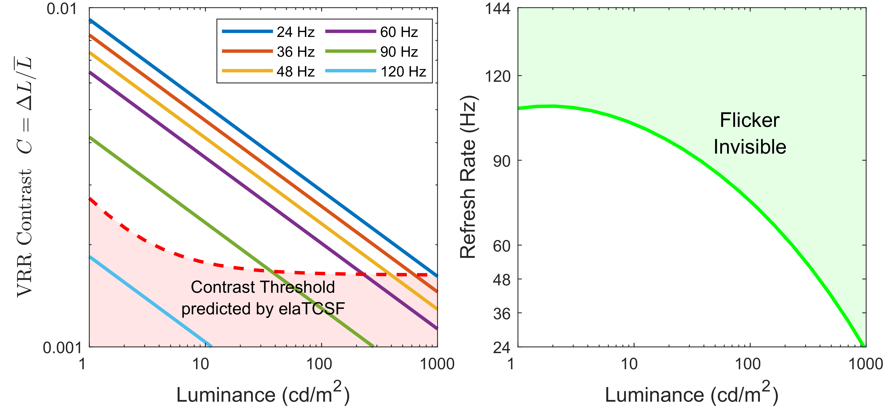
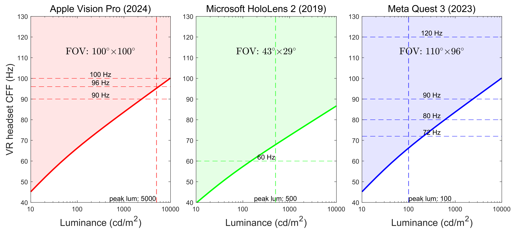
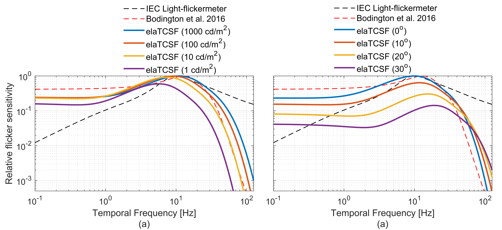

# elaTCSF: A Temporal Contrast Sensitivity Function for Flicker Detection and Modeling Variable Refresh Rate Flicker
Published at SIGGRAPH Asia 2024

<a href="https://caiyancheng.github.io/academic.html">Yancheng Cai</a>,
<a href="https://www.ntnu.edu/employees/ali.bozorgian">Ali Bozorgian</a>,
<a href="https://malihaashraf.github.io/">Maliha Ashraf</a>,
<a href="https://www.linkedin.com/in/robert-wanat-0816a090">Robert Wanat</a>,
<a href="https://www.cl.cam.ac.uk/~rkm38/">Rafał K. Mantiuk</a>

[Project Page](https://www.cl.cam.ac.uk/research/rainbow/projects/elaTCSF/) | [Paper](https://caiyancheng.github.io/papers/elaTCSF_siggraph_asia_2024.pdf)



elaTCSF is an advanced temporal contrast sensitivity function (TCSF) that incorporates eccentricity, luminance, and area. It serves as a comprehensive flicker detection model, extending and updating the industry-standard TCSF_IDMS (Information Display Measurements Standard) (https://www.sid.org/Standards/ICDM). This work also introduces a novel Variable Refresh Rate (VRR) flicker detection dataset, demonstrating the effectiveness of elaTCSF in modeling VRR flicker visibility.

In addition, this work addresses two critical questions:  
1. Are peripheral regions of vision more sensitive to flicker? (A 120-year-long debate)  
2. How can the visibility of flicker across extremely large visual fields be effectively modeled?  

For more details, please refer to the [paper](https://caiyancheng.github.io/papers/elaTCSF_siggraph_asia_2024.pdf).

## Python quickstart
If you only intend to run the Python implementation of elaTCSF, the environment setup is simple:
```python
conda create -n elaTCSF python=3.12
pip install scipy
python elaTCSF.py
```

In the `elaTCSF.py` file, we provide two functions:

- `CSF_elaTCSF.sensitivity_disk`: Computes sensitivity for disk stimuli.
- `CSF_elaTCSF.sensitivity_rectangle`: Computes sensitivity for rectangular stimuli.

## Matlab
For a more comprehensive or large-scale application of elaTCSF, we recommend using our MATLAB code, which offers faster computation.

In the `CSF_elaTCSF_sample_usage.m` file, we provide two examples:

- `csf_elaTCSF_model.sensitivity`: Computes sensitivity for disk stimuli.
- `csf_elaTCSF_model.sensitivity_rect`: Computes sensitivity for rectangular stimuli.


## Applications
Our code includes three potential applications of elaTCSF.
### I. Prediction of Frame Rate Range for VRR Displays
elaTCSF calculates flicker-free refresh rate ranges for VRR displays at varying luminance levels, providing a robust alternative to manual adjustment of refresh rate ranges. In a simulated 27-inch 24–144 Hz display, elaTCSF determines the lower bound of the flicker-free range by intersecting VRR-induced contrast curves with detection thresholds across luminance levels, ensuring effective flicker mitigation.



Using `Application_VRR_range.m`

### II. Low persistence flicker in VR headsets
elaTCSF predicts critical flicker fusion (CFF) thresholds for VR headsets, addressing low-persistence flicker under varying luminance and FoV conditions. Results highlight how refresh rates must adapt to prevent visible flicker as luminance increases.



Using `Application_VR_headset.m`

### III. Application in lighting design
elaTCSF improves flicker sensitivity predictions for modern lighting systems, addressing limitations in current IEC standards based on outdated TCSF measurements. Unlike prior models, elaTCSF accounts for luminance and viewing conditions, enabling perceptually accurate updates to the lighting flicker index.



Using `Application_Light_Design.m`
